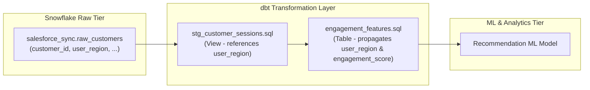

# Prognosis Demo dbt Repository (`prognosis-demo-dbt`)

[](https://www.getdbt.com/)
[](https://www.snowflake.com/)
[](LICENSE)

> **Demo dbt project for the [Prognosis](https://github.com/FDD-io/prognosis) project at the DataHub Hackathon.**

---

## 📌 Overview & Role in Prognosis

This repository represents the **dbt transformation pipeline layer** in the **Prognosis** demonstration scenario.

**Prognosis** is an automated data contract, impact analysis, and self-healing data pipeline tool built for the DataHub ecosystem. This repository demonstrates how schema changes upstream (e.g. column renames in Snowflake source tables) affect downstream dbt models and ML feature pipelines, and how Prognosis detects contract breaks and auto-repairs SQL models.

---

## 🏗️ Data Pipeline Architecture



### Lineage Flow

1. **Source Table (`salesforce_sync.raw_customers`)**: Raw CRM data ingested into Snowflake. Contains `customer_id`, `user_region`, `signup_date`, and `plan_tier`.
2. **Staging Model (`models/staging/stg_customer_sessions.sql`)**: Cleans raw data and explicitly projects `user_region`.
3. **Feature Model (`models/features/engagement_features.sql`)**: Computes `engagement_score` and `account_age_days` while propagating `user_region`.
4. **Downstream Consumer**: An ML Recommendation Model depending on `engagement_features`.

---

## 🚨 The Breaking Scenario & Prognosis Fix

### The Problem
An upstream database migration or CRM schema change renames column `user_region` to `user_geo` in `salesforce_sync.raw_customers`.

1. **dbt Compilation Error**: `stg_customer_sessions.sql` fails during `dbt run` or data testing (`user_region` not found).
2. **Downstream ML Failure**: `engagement_features` table is either not built or missing required feature columns, breaking the recommendation model in production.

### The Prognosis Solution
Using DataHub metadata lineage and AST-level automated code refactoring, **Prognosis**:
1. Intercepts the schema change in DataHub metadata.
2. Identifies all dependent models ([stg_customer_sessions.sql](file:///models/staging/stg_customer_sessions.sql) & [engagement_features.sql](file:///models/features/engagement_features.sql)).
3. Automatically generates and applies a fix, updating references from `user_region` to `user_geo` across the dbt project and schema contracts.

---

## 📁 Repository Structure

```
prognosis-demo-dbt/
├── dbt_project.yml          # dbt project configuration (name: prognosis_demo)
├── README.md                # Project documentation
├── profiles.yml.example     # Sample Snowflake connection configuration
├── models/
│   ├── sources.yml          # Source definition for salesforce_sync.raw_customers
│   ├── staging/
│   │   ├── stg_customer_sessions.sql   # Staging model explicitly referencing user_region
│   │   └── schema.yml                  # Data tests (unique, not_null)
│   └── features/
│       ├── engagement_features.sql     # Feature model calculating engagement_score
│       └── schema.yml                  # Feature descriptions and quality tests
├── .gitignore               # Target, packages, and credentials exclusion
└── LICENSE                  # Apache 2.0 License
```

---

## 🚀 Quickstart

### Prerequisites
- Python 3.8+
- dbt-snowflake (or dbt-core with appropriate adapter)

### Setup & Execution
1. Copy the example profile:
   ```bash
   cp profiles.yml.example ~/.dbt/profiles.yml
   ```
2. Configure credentials in `~/.dbt/profiles.yml`.
3. Test connection & compile dbt models:
   ```bash
   dbt debug
   dbt compile
   ```
4. Run models and tests:
   ```bash
   dbt run
   dbt test
   ```

---

## 🔗 Related Repositories & Hackathon

- **Main Prognosis Repository**: [FDD-io/prognosis](https://github.com/FDD-io/prognosis)
- **DataHub Hackathon**: Built to showcase metadata-driven resilience in modern data stacks.

---

## 📄 License

Licensed under the [Apache License 2.0](LICENSE).